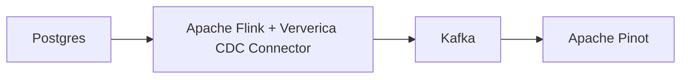
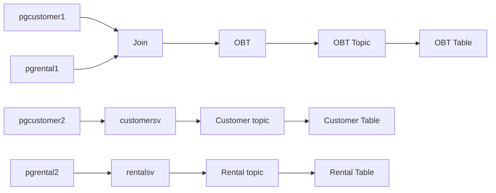
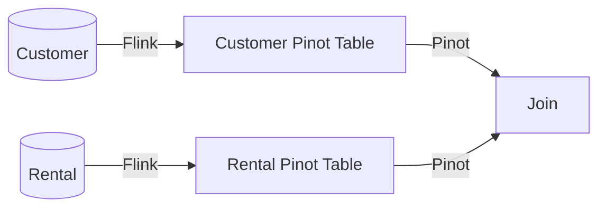

# Pinot Joins vs Flink Joins

In this example, we will show you a real-time analytical solution that enriches data in two different places: Flink and Pinot.



## Build

Build the Flink image to contain connectors to Postgres CDC and Kafka

```bash
docker compose build --no-cache
```

## Start

Run the docker compose command below to start the demo.

```bash
docker compose up -d
```

## Postgres and Makefile

We need to load sample data and enable Postgres for change data capture.

Sample database https://www.postgresqltutorial.com/postgresql-getting-started/postgresql-sample-database/

Download the `Download DVD Rental Sample Database` at the bottom of the page which is a dump from Postgres. Follow the instructions below to unpack the zip file. We will use `pg_restore` to restore the data into our instance of Postgres.

```bash
mkdir data
unzip dvdrental.zip
mv dvdrental.tar data
```

All the commands are available in the Makefile, which we'll leverage to run a series of steps. Run the command below to initialize all postgres, kafka, flink, and pinot.

```bash
make all
```

You may need to rerun some commands if the server is unavailable.

Proceed to the Flink and Pinot consoles:

Flink http://localhost:8081
Pinot http://localhost:9000

To log into Postgres, run the command below:

```bash
docker exec -it postgres psql -h localhost -U postgres
```

## Flink Postgres CDC Connector

The Flink image is prepared with two connectors: Kafka and Ververica's Postgres CDC connector that wraps Debezium's Postgres connector. (The Makefile does all of this work already. No need to run it.)

```sql
CREATE TABLE pgcustomer (
    customer_id int primary key not enforced,
    store_id int,
    first_name string,
    last_name string,
    email string,
    address_id string,
    activebool boolean,
    last_update TIMESTAMP(3)
) WITH (
    'connector' = 'postgres-cdc', -- postgres cdc connector
    'hostname' = 'postgres',
    'port' = '5432',
    'username' = 'postgres',
    'password' = 'postgres',
    'database-name' = 'dvdrental',
    'schema-name' = 'public',
    'table-name' = 'customer',
    'slot.name' = 'pgcustomers',
    'scan.incremental.snapshot.enabled' = 'true',
    'decoding.plugin.name'='pgoutput'
);
```

In Postgres, view the replication slots:

```sql
select * from pg_replication_slots;
```

Flink DAG:



___**We are not reusing the pgcustomer1 and pgrental1. Cannot reuse the replication slot to build a new leg in the Flink DAG.**___

___**We also cannot write directly from the source table to a sink. We need to have a view in between.**___


## Joining in Flink - Flink SQL

In Flink, you'll need to create the destination table that 

```sql

CREATE TABLE OBT (
    rental_id INT,
    rental_date TIMESTAMP(3),
    inventory_id INT,
    customer_id INT,
    return_date TIMESTAMP(3),
    staff_id INT,
    last_update TIMESTAMP(3),
    customer_id INT,
    store_id INT,
    first_name STRING,
    last_name STRING,
    email STRING,
    address_id STRING,
    activebool BOOLEAN,
    last_updated TIMESTAMP(3),
    PRIMARY KEY (rental_id) NOT ENFORCED
)
WITH (
    'connector' = 'upsert-kafka',
    'topic' = 'obt',
    'properties.bootstrap.servers' = 'kafka:9092',
    'properties.group.id' = 'obt',
    'key.format' = 'json',
    'value.format' = 'json'
);

INSERT INTO OBT SELECT * 
FROM pgrentals r
JOIN pgcustomer c  ON r.customer_id=c.customer_id;

```

## Joining in Apache Pinot



Instead of standing up a Debezium Server or Kafka Connect cluster, we will reuse the Flink cluster we have to pass data through and send data to Pinot.

```sql
CREATE OR REPLACE TABLE customers_sink(
    customer_id int primary key not enforced,
    store_id int,
    first_name string,
    last_name string,
    email string,
    address_id string,
    activebool boolean,
    last_updated TIMESTAMP(3)
)
WITH (
    'connector' = 'upsert-kafka',
    'topic' = 'customer_sink',
    'properties.bootstrap.servers' = 'kafka:9092',
    'key.format' = 'json',
    'value.format' = 'json'
);

create view customersv as SELECT *
FROM pgcustomer;

INSERT INTO customers_sink SELECT *
FROM customersv;


CREATE OR REPLACE TABLE rental_sink(
    rental_id  int,
    rental_date timestamp(3),
    inventory_id int,
    customer_id int,
    return_date timestamp(3),
    staff_id int,
    last_update timestamp(3),
    PRIMARY KEY (rental_id) NOT ENFORCED
)
WITH (
    'connector' = 'upsert-kafka',
    'topic' = 'rental_sink',
    'properties.bootstrap.servers' = 'localhost:9092',
    'key.format' = 'json',
    'value.format' = 'json'
);

create view rentalsv as SELECT *
FROM pgrentals;

insert into rental_sink select * from rentalsv;
```

## Difference between Joining in the Push Query vs Pull Query

```sql
SELECT 
    rental_id,
    rental_date,
    inventory_id,
    r.customer_id,
    return_date,
    staff_id,
    r.last_update as rental_last_update,
    store_id,
    first_name,
    last_name,
    email,
    address_id,
    activebool,
    c.last_update as customer_last_update
FROM rental r
LEFT JOIN customers c  ON r.customer_id=c.customer_id;

```

The OBT table will be faster without the multi-stage engine. Have more flexibility when joining in Pinot.
