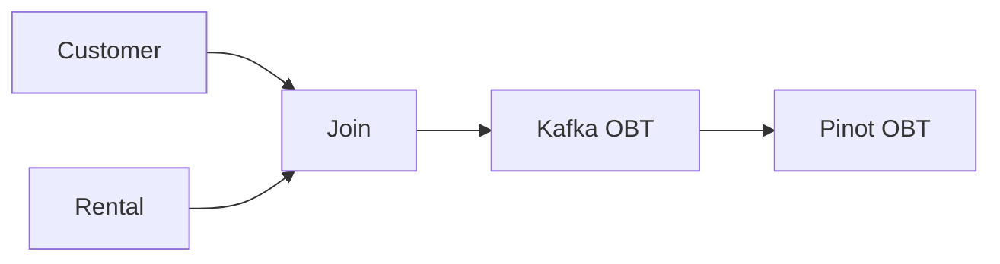
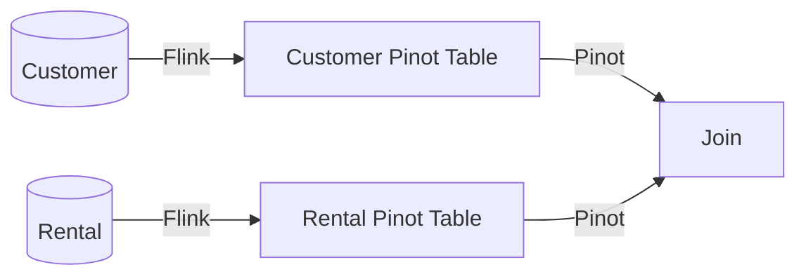

# Pinot Joins vs Flink Joins

In this example, we will show you a real-time analytical solution that enriches data in two different places: Flink and Pinot.


## Configuring Postgres For Change Data Capture

We need to load sample data and enable Postgres for change data capture.

Sample database https://www.postgresqltutorial.com/postgresql-getting-started/postgresql-sample-database/

Download the `Download DVD Rental Sample Database` at the bottom of the page which is a dump from Postgres. Follow the instructions below to unpack the zip file. We will use `pg_restore` to restore the data into our instance of Postgres.

```bash
mkdir data
unzip dvdrental.zip
mv dvdrental.tar data
docker compose postgres up -d

# Log into the postgres instance
docker exec -it postgres bash
psql -h localhost -U postgres -W

```

The dump requires a database instance named `dvdrental`. Log into Postgres using the command below. Create the database using the command below.

```sql
CREATE DATABASE dvdrental;

ALTER ROLE "postgres" WITH LOGIN;
ALTER USER postgres REPLICATION;
--GRANT ALL PRIVILEGES ON DATABASE dvdrental TO postgres;
ALTER ROLE postgres WITH SUPERUSER CREATEDB CREATEROLE LOGIN ENCRYPTED PASSWORD 'postgres';

\q -- exit
```

Once back on the bash shell, execute the `pg_restor` command to restore the dump into your own Postgres instance.

```bash
pg_restore -h localhost -U postgres -d dvdrental /tmp/data/dvdrental.tar
```

Log back into Postgres and explore the restored database.
```bash
psql -h localhost -U postgres -W
```

```sql
\l -- list databases
\c dvdrental -- connecto to the restored databased
\d -- list tables (hit `q` to escape from the list)
select * from customer limit 10;

-- enable CDC on tables.
ALTER TABLE public.customer REPLICA IDENTITY FULL;
ALTER TABLE public.rental REPLICA IDENTITY FULL;
```

The last two commands enable CDC the tables we want to consume.

## Flink

Run the command below from Flink home.

```bash
docker-compose exec -it jobmanager bash

# start the flink sql shell
./bin/sql-client.sh -l lib
```

```sql

CREATE TABLE pgcustomer (
    customer_id int primary key not enforced,
    store_id int,
    first_name string,
    last_name string,
    email string,
    address_id string,
    activebool boolean,
    last_update TIMESTAMP(3)
) WITH (
    'connector' = 'postgres-cdc', -- postgres cdc connector
    'hostname' = 'postgres',
    'port' = '5432',
    'username' = 'postgres',
    'password' = 'postgres',
    'database-name' = 'dvdrental',
    'schema-name' = 'public',
    'table-name' = 'customer',
    'slot.name' = 'pgcustomers',
    'scan.incremental.snapshot.enabled' = 'true',
    'decoding.plugin.name'='pgoutput'
);


```

```sql
CREATE TABLE pgrentals (
    rental_id  int  primary key not enforced,
    rental_date timestamp(3),
    inventory_id int,
    customer_id int,
    return_date timestamp(3),
    staff_id int,
    last_update timestamp(3)
) WITH (
    'connector' = 'postgres-cdc', -- postgres cdc connector
    'hostname' = 'localhost',
    'port' = '5432',
    'username' = 'postgres',
    'password' = 'postgres',
    'database-name' = 'dvdrental',
    'schema-name' = 'public',
    'table-name' = 'rental',
    'slot.name' = 'pgrentals',
    'scan.incremental.snapshot.enabled' = 'true',
    'decoding.plugin.name'='pgoutput'
);
```

## Joining in Flink - Flink SQL



```bash
kafka-topics --bootstrap-server localhost:9092 --create --topic obt
```

In Flink, you'll need to create the destination table that 

```sql

CREATE TABLE OBT (
    customer_id INT,
    store_id INT,
    first_name STRING,
    last_name STRING,
    email STRING,
    address_id STRING,
    activebool BOOLEAN,
    last_updated TIMESTAMP(3),
    rental_id INT,
    rental_date TIMESTAMP(3),
    inventory_id INT,
    customer_id0 INT,
    return_date TIMESTAMP(3),
    staff_id INT,
    last_update TIMESTAMP(3),
    PRIMARY KEY (rental_id) NOT ENFORCED
)
WITH (
    'connector' = 'upsert-kafka',
    'topic' = 'obt',
    'properties.bootstrap.servers' = 'localhost:9092',
    'properties.group.id' = 'obt',
    'key.format' = 'json',
    'value.format' = 'json'
);

INSERT INTO OBT SELECT * 
FROM pgcustomer c 
JOIN pgrentals r ON c.customer_id=r.customer_id;

```

Sample output into the OBT topic.
```json
{
    "customer_id": 111,
    "store_id": 1,
    "first_name": "Carmen",
    "last_name": "Owens",
    "email": "carmen.owens@sakilacustomer.org",
    "address_id": "115",
    "activebool": true,
    "last_updated": null,
    "rental_id": 8525,
    "rental_date": "2005-07-29 10:20:19",
    "inventory_id": 1322,
    "customer_id0": 111,
    "return_date": "2005-07-30 05:49:19",
    "staff_id": 2,
    "last_update": "2006-02-16 02:30:53"
}
```

```bash
docker run \
    -v ${PWD}/sample.json:/data/sample.json \
    -v ${PWD}/config:/config \
    apachepinot/pinot:latest JsonToPinotSchema \
    -jsonFile /data/sample.json \
    -pinotSchemaName="obt" \
    -outputDir="/config" \
    -dimensions=""
```

## Joining in Apache Pinot



Instead of standing up a Debezium Server or Kafka Connect cluster, we will reuse the Flink cluster we have to pass data through and send data to Pinot.

```sql
CREATE OR REPLACE TABLE customers_sink(
    customer_id int primary key not enforced,
    store_id int,
    first_name string,
    last_name string,
    email string,
    address_id string,
    activebool boolean,
    last_updated TIMESTAMP(3)
)
WITH (
    'connector' = 'upsert-kafka',
    'topic' = 'customers_sink',
    'properties.bootstrap.servers' = 'localhost:9092',
    'key.format' = 'json',
    'value.format' = 'json'
);

create view customersv as SELECT *
FROM pgcustomer;

INSERT INTO customers_sink SELECT *
FROM customersv;


CREATE OR REPLACE TABLE rental_sink(
    rental_id  int,
    rental_date timestamp(3),
    inventory_id int,
    customer_id int,
    return_date timestamp(3),
    staff_id int,
    last_update timestamp(3),
    PRIMARY KEY (rental_id) NOT ENFORCED
)
WITH (
    'connector' = 'upsert-kafka',
    'topic' = 'rentals_sink',
    'properties.bootstrap.servers' = 'localhost:9092',
    'key.format' = 'json',
    'value.format' = 'json'
);

create view rentalsv as SELECT *
FROM pgrentals;

insert into rental_sink select * from rentalsv;
```

