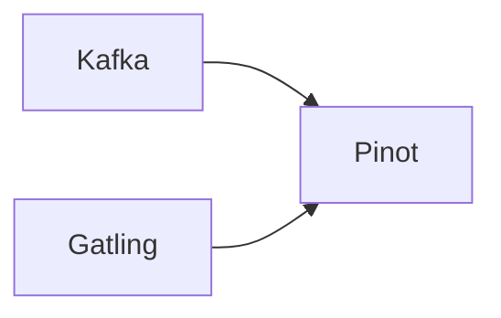
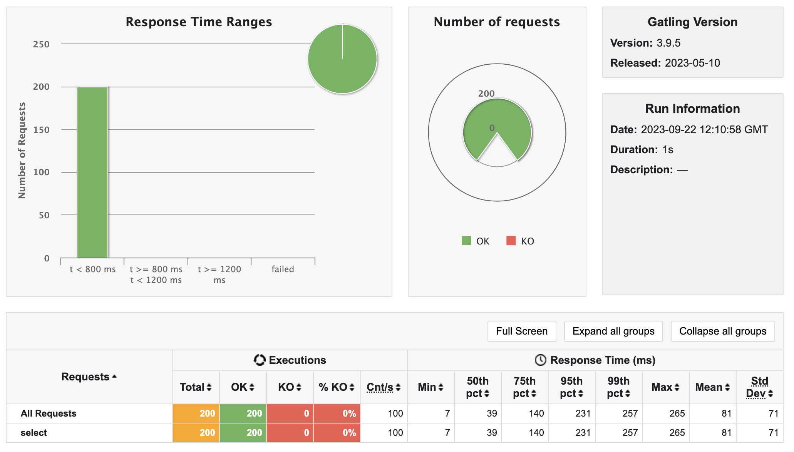

# Performance Testing Apache Pinot with Gatling
Apache Pinot, an open-source distributed data store, has emerged as a powerful tool for handling high-velocity, low-latency data at scale. To ensure that Pinot meets the demands of real-time analytics, it's essential to conduct comprehensive performance testing.

This presentation aims to guide you through the process of performance testing Apache Pinot using [Gatling](https://gatling.io/docs/gatling/tutorials/quickstart/), a widely-used load testing tool. We'll explore the key concepts, methodologies, and best practices for assessing the performance and scalability of your Pinot cluster.

## Tools To Install
- [sbt - scala build tool](https://www.scala-sbt.org/download.html)
- [Docker](https://www.docker.com/get-started/)
- [git](https://github.com/git-guides/install-git)
- [jq](https://pypi.org/project/jq/)

And of course, your favoraite IDE or editor.

## Use Case



We will be using one of the `QuickStart` applications that come with Apache Pinot for quick setup. Pinot comes with many QuickStart examples that can be found here https://docs.pinot.apache.org/basics/getting-started/quick-start. We will be using the `stream` QuickStart.

```bash
docker run \
    -p 9000:9000 \
    -p 8000:8000 \
    apachepinot/pinot:latest QuickStart \
    -type stream
```

In this QuickStart, we use Docker to start a single node Kafka cluster along with Pinot. This command also does the following:

- Starts Apache Kafka, Apache Zookeeper, Pinot Controller, Pinot Broker, and Pinot Server.
- Creates airlineStats table along with other tables.
- Launches a meetup stream
- Publishes data to a Kafka topic airlineStatsEvents that is subscribed to by Pinot.
- Issues sample queries to Pinot

Test everything is up by invoking the CURL statement below or by going to the Pinot portal http://localhost:9000 and checking that all 8 tables exist.

```bash
curl -H "Content-Type: application/json" -X POST \
   -d '{"sql":"select * from airlineStats limit 100"}' \
   http://localhost:8000/query/sql | jq

```


## Perf Testing with Gatling
Gatling too is a powerful open-source load testing solution designed for continuous load testing and integrates with your development pipeline. Gatling includes a web recorder and colorful reports. You can learn more by visting their documentation https://gatling.io/docs/gatling/tutorials/installation/.

In our example, we will be using Gatling in two ways:

1. A Scala `sbt` plugin. Gatling provides a set of plugins that integrates with your build tool including Maven, Gradle, Jenkins, and others. We will be using the sbt plugin for tests defined in Scala. 
   - Gatling supports Java, Kotlin, and Scala as ways to define performance tests.
2. Testing using the Gatling bundle downloaded from Gatling.io: https://gatling.io/open-source/

## SBT
We will be starting off with the SBT plugin because the code we generate in the `sbt` section can be used in the next `bundle` section.

```bash
git clone https://github.com/gatling/gatling-sbt-plugin-demo
```

This repository is a working example of a project that has Gatling's sbt plugin working. Specifically, the `build.sbt`, `build.properties`, and `plubins.sbt`. More importantly, it will have a sample class that implements a `Simulation` writting in scala.

Below is the tree you will get after you clode the repositry.

```
.
├── README.md
├── build.sbt
├── project
│   ├── build.properties
│   └── plugins.sbt
└── src
    ├── it
    │   └── scala
    │       └── computerdatabase
    │           └── BasicItSimulation.scala <-- CHANGE THIS CODE
    └── test
        ├── resources
        │   ├── gatling.conf
        │   ├── logback-test.xml
        │   ├── recorder.conf
        │   └── search.csv
        └── scala
            └── computerdatabase
                └── ComputerDatabaseSimulation.scala                
```

### Sample Simulation
If you are not familiar with scala, don't worry, the code should be easy enough for you to understand what is happening.

Firstly, we have some important imports: `io.gatling.core.Predef._` and `io.gatling.http.Predef._`. Core is obviously the core of Gatling. The `http` import provids the libraries enable you to invoke REST APIs.

In the code example below, `.post("http://localhost:8000/query/sql")` is the Apache Pinot SQL endpoint. This is how you can invoke SQL queries in your Gatling test.

Look at the directory tree above, navigate to the `BasicItSimulation.scala` source and replace the contents of the sample Gatling scala code that comes with the repository with the contents below.

```scala
package computerdatabase

import io.gatling.core.Predef._
import io.gatling.http.Predef._
import scala.concurrent.duration._

class BasicItSimulation extends Simulation {

  val h = http("select")
    .post("http://localhost:8000/query/sql") // Pinot SQL endpoint
    .header("content-type", "application/json")
    .body(StringBody("{ \"sql\":\"select CancellationCode, avg(ArrDelayMinutes) delay from airlineStats group by CancellationCode\"}")) // JSON Request

  val s = scenario("Select").exec(h).pause(1).exec(h)  // Create a scenario

  setUp(
    s.inject(atOnceUsers(100)) // Create users
  )
}
```

The `http().post()` object provides a way to provide the `body` of the request. In our case, it's a `StringBody` because it's a JSON object. See below.

```scala
.body(StringBody("{ \"sql\":\"select CancellationCode, avg(ArrDelayMinutes) delay from airlineStats group by CancellationCode\"}"))
```

We will be invoking the statement.
```sql
select 
  CancellationCode, 
  avg(ArrDelayMinutes) delay 
from airlineStats 
group by CancellationCode
```

Next, we create a scenario where we execute the POST request (the SQL statement) referenced by `h`. Then we `pause` for 1 second then execute the sql again `h`. 

Gatling Scenarios define logic or user behavor on an application that calls Apache Pinot's SQL API.

```scala
val s = scenario("Select").exec(h).pause(1).exec(h)
```

Finally, the simulation is set up by providing `100` end users using the application at the same time.

```scala
setUp(
    s.inject(atOnceUsers(100))
  )
```

So in this scenario, we are simulating the execution of the above SQL statement being invoked by 100 users TWICE (with a 1 second pause in between). So 200 requests in all.

### Running the Test
To run Gatling, you will need to execute

```bash
sbt 'GatlingIt/testOnly computerdatabase.BasicItSimulation'
```

When Gatling runs, you'll see logs for each request being sent. At the end of the test, you will see a report similar to the one below.

```log
Generating reports...

================================================================================
---- Global Information --------------------------------------------------------
> request count                                        200 (OK=200    KO=0     )
> min response time                                      7 (OK=7      KO=-     )
> max response time                                    265 (OK=265    KO=-     )
> mean response time                                    81 (OK=81     KO=-     )
> std deviation                                         71 (OK=71     KO=-     )
> response time 50th percentile                         39 (OK=39     KO=-     )
> response time 75th percentile                        140 (OK=140    KO=-     )
> response time 95th percentile                        231 (OK=231    KO=-     )
> response time 99th percentile                        257 (OK=257    KO=-     )
> mean requests/sec                                    100 (OK=100    KO=-     )
---- Response Time Distribution ------------------------------------------------
> t < 800 ms                                           200 (100%)
> 800 ms <= t < 1200 ms                                  0 (  0%)
> t >= 1200 ms                                           0 (  0%)
> failed                                                 0 (  0%)
================================================================================
Reports generated in 0s.
Please open the following file: file:///./target/gatling-it/basicitsimulation-20230922115416540/index.html
[info] Simulation BasicItSimulation successful.
[info] Simulation(s) execution ended.
[success] Total time: 9 s, completed Sep 22, 2023, 7:54:22 AM
```

Better yet, open the file where the output says `Please open the following file:`. This will open a dynamic web report.



From here, you can study the report and make adjustments to the Pinot indexes to help speed up the query. (We'll do this in a later example).

## Bundle
We can do the same test using the Gatling bundle which is a stand alone solution that you can download [here](https://gatling.io/docs/gatling/tutorials/installation/#using-the-bundle). Explode the archive and navigate into the directory. There are a lot of files in it as you can see below.

```
├── LICENSE
├── bin
│   ├── gatling.bat
│   ├── gatling.sh
│   ├── recorder.bat
│   └── recorder.sh
├── conf
│   ├── gatling-akka.conf
│   ├── gatling.conf
│   ├── logback.xml
│   └── recorder.conf
├── lib
│   ├── ... many jars
├── results
│   ├── ... where your reports land
├── target
│   ├── inc_compile.zip
│   └── test-classes
│       └── computerdatabase
│           ├── BasicItSimulation.class
└── user-files
    ├── lib
    ├── resources
    │   └── search.csv
    └── simulations
        ├── ai
        │   └── startree
        │       └── gatling
        └── computerdatabase
            ├── BasicItSimulation.scala <-- Your Scala Code

27 directories, 271 files

```

Navigate to the `BasicItSimulation.scala` source above and paste the same scala code from the [SBT](#sbt) test.

Run the simulation by executing the command below. The bundle is an interactive tool.

```bash
$ ./bin/gatling.sh

Do you want to run the simulation locally, on Gatling Enterprise, or just package it?
Type the number corresponding to your choice and press enter
[0] <Quit>
[1] Run the Simulation locally
[2] Package and upload the Simulation to Gatling Enterprise Cloud, and run it there
[3] Package the Simulation for Gatling Enterprise
[4] Show help and exit
1 # ENTER 1
08:18:39.094 [WARN ] i.g.c.ZincCompiler$ - -target is deprecated: Use -release instead to compile against the correct platform API.
08:18:40.330 [WARN ] i.g.c.ZincCompiler$ - one warning found
Choose a simulation number:
     [0] computerdatabase.BasicItSimulation
     [1] computerdatabase.ComputerDatabaseSimulation
0 # ENTER 0. THIS APPEARS IF YOU HAVE MORE THAN ONE SIMULATION
Select run description (optional)
run # TYPE RUN

```


You will again get a similar output.

```
Simulation computerdatabase.BasicItSimulation completed in 0 seconds
Parsing log file(s)...
Parsing log file(s) done
Generating reports...

================================================================================
---- Global Information --------------------------------------------------------
> request count                                        100 (OK=0      KO=100   )
> min response time                                     23 (OK=-      KO=23    )
> max response time                                     91 (OK=-      KO=91    )
> mean response time                                    57 (OK=-      KO=57    )
> std deviation                                         15 (OK=-      KO=15    )
> response time 50th percentile                         59 (OK=-      KO=59    )
> response time 75th percentile                         65 (OK=-      KO=65    )
> response time 95th percentile                         87 (OK=-      KO=87    )
> response time 99th percentile                         91 (OK=-      KO=91    )
> mean requests/sec                                    100 (OK=-      KO=100   )
---- Response Time Distribution ------------------------------------------------
> t < 800 ms                                             0 (  0%)
> 800 ms <= t < 1200 ms                                  0 (  0%)
> t >= 1200 ms                                           0 (  0%)
> failed                                               100 (100%)
---- Errors --------------------------------------------------------------------
> status.find.in([200, 209], 304), found 400                        100 (100.0%)
================================================================================

Reports generated in 0s.
Please open the following file: file:///Users/hubertdulay/development/startree-examples/examples/gatling/gatling-charts-highcharts-bundle-3.9.5/results/basicitsimulation-20230922121449042/index.html
```
Again you can open the file for a dynamic report.

## Summary
Apache Pinot is an extremely powerful real-time OLAP system that enables low queries per second (QPS) and high concurrency (number of end users). You can use Gatling to prove Pinot's capabilties over other solutions.

If you want to try out Apache Pinot, the following resources will help you get started:

- Download page: https://pinot.apache.org/download/ 
- Getting started: https://docs.pinot.apache.org/getting-started 
- Join our Slack channel: https://communityinviter.com/apps/apache-pinot/apache-pinot 
- See our upcoming events: https://www.meetup.com/apache-pinot 
- Follow us on social media: https://twitter.com/ApachePinot 
