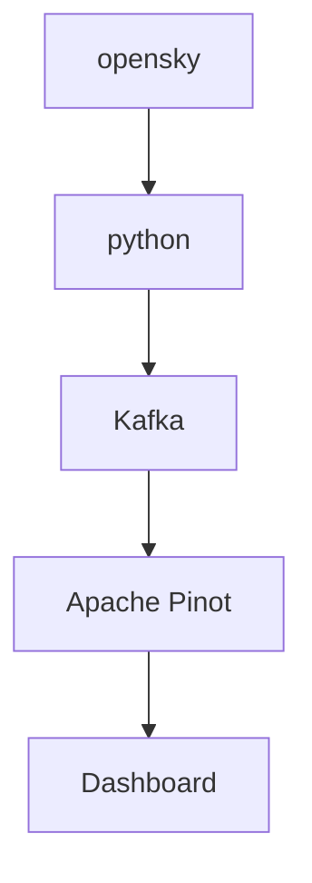

# OpenSky Demonstration

OpenSky Network’s live API. The API lets you retrieve live airspace information for research and non-commerical purposes.

This example will follow the diagram below.

## Deployment
WIP