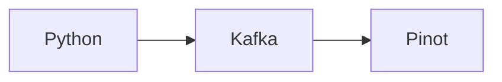

# Wikipedia



## Homebrew Kafka Formulae
In this exmample, we're going to run a local Kafka cluster that was installed using `brew` on MacOS.

```bash
brew install kafka
```

If you already have brew Kafka installed, then to ensure Kafka starts up fresh, delete the file below so that Kafka doesn't think it's trying to join a differen cluster ID. You may need to do this every time you restart Kafka.

```bash
rm /usr/local/var/lib/kafka-logs/meta.properties
```

Configure the `server.properties` file if needed for security. Otherwise, you should not need to edit this file.
```bash
vim /usr/local/etc/kafka/server.properties
```

Start Kafka

```bash
brew services start kafka
# brew services restart kafka # to restart
```

Tail the log
```bash
tail -f /usr/local/var/log/kafka/kafka_output.log
```

Then verify that Kafka is listening

```bash
nc -v localhost 9092
```

Now create a topic in Kafka.

```bash
kafka-topics --bootstrap-server localhost:9092 --create --topic wiki
```

## Homebrew Pinot Formulae
In this exmample, we're going to run a local Pinot cluster that was also installed using `brew` on MacOS.

```bash
brew install pinot
```

Tail the Pinot logs.

```bash
tail -f /usr/local/var/log/pinot/pinot_output.log
```

## Pinot Table

Below is a sample message in Kafka.

```json
{
"title": "Puerto Rico statehood movement",
"title_detail": {
    "type": "text/plain",
    "language": null,
    "base": "https://en.wikipedia.org/w/api.php?action=feedrecentchanges",
    "value": "Puerto Rico statehood movement"
},
"links": [
    {
        "rel": "alternate",
        "type": "text/html",
        "href": "https://en.wikipedia.org/w/index.php?title=Puerto_Rico_statehood_movement&diff=1178445562&oldid=1175414997"
    }
],
"link": "https://en.wikipedia.org/w/index.php?title=Puerto_Rico_statehood_movement&diff=1178445562&oldid=1175414997",
"id": "https://en.wikipedia.org/w/index.php?title=Puerto_Rico_statehood_movement&diff=1178445562&oldid=1175414997",
"guidislink": false,
"summary": "HTML GOES IN HERE",
"summary_detail": {
    "type": "text/html",
    "language": null,
    "base": "https://en.wikipedia.org/w/api.php?action=feedrecentchanges",
    "value": "HTML GOES IN HERE"
},
"published": "Tue, 03 Oct 2023 18:31:50 GMT",
"published_parsed": [
    2023,
    10,
    3,
    18,
    31,
    50,
    1,
    276,
    0
],
"authors": [
    {
        "name": "217.26.199.96"
    }
],
"author": "217.26.199.96",
"author_detail": {
    "name": "217.26.199.96"
},
"comments": "https://en.wikipedia.org/wiki/Talk:Puerto_Rico_statehood_movement"
}

```
This sample document looks complex but we can automatically infer the schema by running the `JsonToPinotSchema` tool.

### Infer the Schema

```bash
# download docker compose
curl https://raw.githubusercontent.com/startreedata/pinot-recipes/main/recipes/infer-schema-json-data/docker-compose.yml --output docker-compose.yml

# create a directory for the output schema to be written
mkdir config

# run the infer tool JsonToPinotSchema
docker run \
    -v ${PWD}/sample.json:/data/sample.json \
    -v ${PWD}/config:/config \
    apachepinot/pinot:latest JsonToPinotSchema \
    -jsonFile /data/sample.json \
    -pinotSchemaName="wiki" \
    -outputDir="/config" \
    -dimensions=""
```

The schema will appear in the `config` directory. You'll need to modify it to add a timestamp. Delete the `published` field and append this to the end of the schema.

```json
  ,"dateTimeFieldSpecs": [{
      "name": "published",
      "dataType": "STRING",
      "format" : "1:SECONDS:TIMESTAMP:EE, dd MMM yyyy HH:mm:SS zzz",
      "granularity": "1:SECONDS"
  }]
```

The final schema can be seen [here](./schema.json)

### Table Config

```json
{
    "tableName": "transcript",
    "tableType": "REALTIME",
    "segmentsConfig": {
        "timeColumnName": "timestamp",
        "timeType": "MILLISECONDS",
        "schemaName": "transcript",
        "replicasPerPartition": "1"
    }, 
    "ingestionConfig": {
      "complexTypeConfig": {
        "delimeter": "."
      }
    },
    "tenants": {},
    "tableIndexConfig": {
        "loadMode": "MMAP",
        "streamConfigs": {
            "streamType": "kafka",
            "stream.kafka.consumer.type": "lowlevel",
            "stream.kafka.topic.name": "wiki",
            "stream.kafka.decoder.prop.format": "JSON",
            "stream.kafka.decoder.class.name": "org.apache.pinot.plugin.stream.kafka.KafkaJSONMessageDecoder",
            "stream.kafka.consumer.factory.class.name": "org.apache.pinot.plugin.stream.kafka20.KafkaConsumerFactory",
            "stream.kafka.broker.list": "localhost:9092",
            "realtime.segment.flush.threshold.time": "3600000",
            "realtime.segment.flush.threshold.rows": "50000",
            "stream.kafka.consumer.prop.auto.offset.reset": "smallest"
        }
    },
    "metadata": {
        "customConfigs": {}
    }
}
```

### Pinot CLI

Create table

```bash
pinot-admin AddTable \
    -tableConfigFile table.config.json \
    -schemaFile schema.json \
    -exec

```

Delete table

```bash
pinot-admin DeleteTable -tableName wiki 
```

```bash
pinot-admin DeleteSchema -schemaName wiki -exec
```

## Execute Qeury

```sql
select author, title, count(*) as c from wiki
group by author, title
having c > 10
order by c desc
```